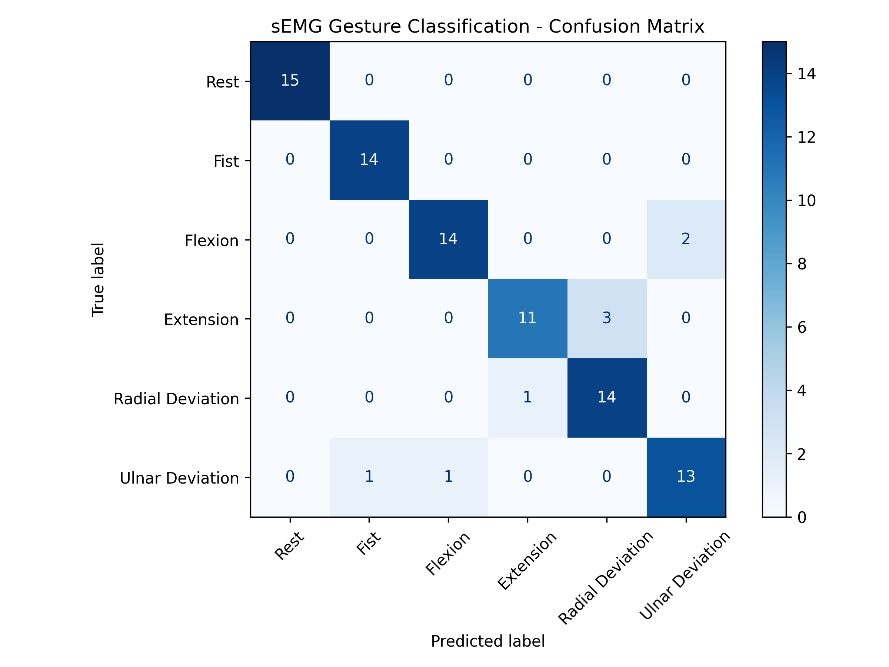

# Real-Time sEMG Gesture Recognition for Robotic Arm Control

This repository presents an end-to-end Machine Learning and Signal Processing pipeline designed to classify human hand gestures using surface Electromyography (sEMG) signals. The primary objective is to translate neuromuscular intentions into discrete control commands for **prosthetic hands and robotic arms**.

---

## 🎯 Project Goal & System Overview
- **Signal Input:** 8-channel sEMG signals collected during active hand gestures.
- **Processing Pipeline:** Real-time digital filtering, feature extraction (RMS, MAV,  across 8 channels = 16 features).
- **Classification Engine:** Random Forest model predicting target gestures with high confidence and minimal latency.
- **Deployment:** Containerized REST API (FastAPI + Docker) engineered to stream predictions directly to an embedded micro-controller / robotic arm controller.

## 📊 Feature Extraction Methodology

To capture the amplitude and contraction intensity of the sEMG signals across the 8 channels, we extract key time-domain features:

### 1. Root Mean Square (RMS)
Represents the mean power and physical intensity of the muscle signal. Higher RMS values correlate directly with stronger muscle contractions.
$$RMS = \sqrt{\frac{1}{N} \sum_{i=1}^{N} x_i^2}$$

### 2. Mean Absolute Value (MAV)
Measures the average magnitude of the sEMG signal over a time window, serving as a reliable indicator of muscle activity level with lower computational complexity.
$$MAV = \frac{1}{N} \sum_{i=1}^{N} |x_i|$$

---

## 🧠 Dual-Mode Prediction Engine

The API provides two distinct prediction workflows to accommodate different client requirements:

1. **Pre-extracted Features Endpoint (`/predict/features`):**
   * Designed for edge devices or clients that perform feature extraction locally.
   * Directly accepts pre-calculated **RMS (Root Mean Square)** and **MAV (Mean Absolute Value)** features to minimize server payload and computing latency.

2. **Raw sEMG Signal Endpoint (`/predict/raw`):**
   * Designed for end-to-end integration where raw multichannel sEMG signal arrays are transmitted directly.
   * The server dynamically applies on-the-fly signal processing, extracting time-domain features (RMS & MAV) before feeding them into the trained Random Forest classifier.

---

## 📚 Project RAG Knowledge Assistant

This project incorporates a **Retrieval-Augmented Generation (RAG)** pipeline powered by **LangChain**, **BM25 Retriever**, and **Groq Cloud (Llama 3.3 70B)**:

* **Contextual Documentation Indexing:** Automatically indexes project documentation (`README.md` and report files) using lightweight BM25 chunk retrieval.
* **Interactive AI Assistant (`/rag/ask`):** Allows developers and users to query project mechanics, signal processing formulas (RMS/MAV), model architecture details, and setup instructions in natural language.
## Quick Start with Docker

You do not need to install Python or any dependencies manually. Simply pull and run the pre-built Docker image from Docker Hub:

docker run -d -p 8000:8000 --env-file .env --name semg_app sina22sas/semg-ai-engine:v2

After running the container, open your browser and go to:
http://localhost:8000/docs to test the API via Swagger UI.

## Supported Gestures

1. Rest
2. Fist
3. Flexion
4. Extension
5. Radial Deviation
6. Ulnar Deviation

## 📊 Model Evaluation & Reports

The model evaluation metrics and visualizations are automatically saved in the `reports/` directory:

- **`reports/confusion_matrix.png`**: Visual representation of model predictions across all 6 gesture classes.
- **`reports/classification_report.txt`**: Detailed metrics including Precision, Recall, and F1-Score.

### Confusion Matrix
